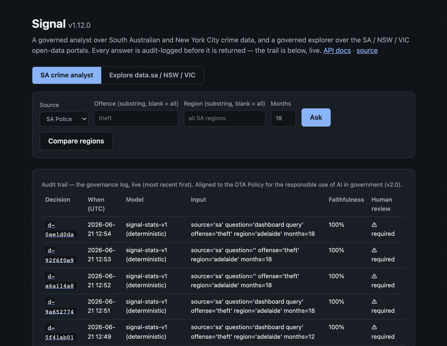
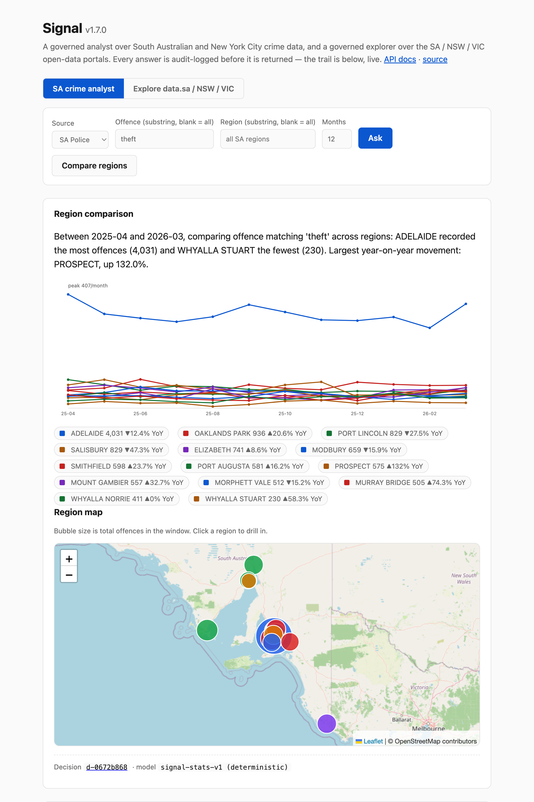
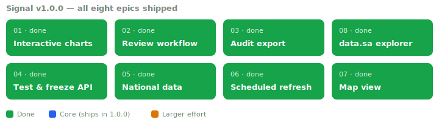

# Signal

[](https://github.com/rNLKJA/signal/actions/workflows/ci.yml)
[](https://rnlkja--signal-api-api.modal.run)
[](pyproject.toml)
[](LICENSE)

An interactive product over South Australian and New York City crime data, with an analyst layer and a governance log that records every AI-assisted answer in a form aligned to the Australian Government's [Policy for the responsible use of AI in government](https://www.digital.gov.au/ai/ai-in-government-policy) (DTA) and the EU AI Act.

**Live demo: https://rnlkja--signal-api-api.modal.run** — ask it something and watch the audit trail fill in. Queries are shareable links: [`/?offense=theft&region=adelaide`](https://rnlkja--signal-api-api.modal.run/?offense=theft&region=adelaide).



<sub>Ask a question → the analyst answers with a trend chart, stats and a faithfulness score → the decision lands at the top of the audit trail, live. ([still screenshot](.github/dashboard.png))</sub>

Most data products show you a chart. Signal also shows you how the answer was reached: which model ran, what data informed it, what decision followed, and whether a human signed off. Every API response carries a `decision_id`, and the audit trail is itself a public endpoint — traceability is part of the product surface, not an ops file.

```bash
curl -X POST https://rnlkja--signal-api-api.modal.run/ask \
  -H 'Content-Type: application/json' \
  -d '{"question": "How is theft trending in Adelaide?", "offense": "theft", "region": "adelaide"}'
```

```json
{
  "narrative": "Between 2025-04 and 2026-03, SA Police recorded 4,031 offences for offences matching 'theft' in ADELAIDE. The trend over the window is flat. The latest month is up 30.0% on the month before. Year on year, the latest month is down 12.4%. Anomalous months flagged for human review: 2025-04.",
  "stats": { "trend_direction": "flat", "yoy_change_pct": -12.4, "...": "..." },
  "decision_id": "d-7fb4f81e",
  "data_source": "SA Police Crime statistics (data.gov.au) — FY2024-25 + FY2025-26 YTD — bundled snapshot",
  "model_used": "signal-stats-v1 (deterministic)",
  "human_review_required": true
}
```

That `decision_id` resolves at `GET /decisions` to the full audit entry: model provenance, data sources, decision category, confidence, risk tier, and the human-review flag.

## The problem

The Australian Government's [Policy for the responsible use of AI in government](https://www.digital.gov.au/ai/ai-in-government-policy) (DTA, Version 2.0, published 1 Dec 2025) makes AI governance mandatory across the public service. The **first mandatory requirements commence 15 June 2026**, and mandatory **AI use-case impact assessments** follow by **15 December 2026**. Agencies must designate accountable officials, maintain a register of in-scope AI use cases, publish [AI transparency statements](https://www.dta.gov.au/ai-transparency-statement), and run impact assessments. The EU AI Act (2024/1689) adds risk-tier classification and traceability, and the Privacy Act 1988 (Cth) reforms add an automated decision-making disclosure obligation.

These rules are easy to nod along to and hard to actually meet, because compliance has to be captured at the moment a decision is made, not reconstructed for an auditor afterwards. Signal wires the record into the request path: the analyst cannot answer without logging, and the use-case register and transparency statement are generated live from that log.

The data deliberately sits in the same domain the author works in — policing — so the governance question is concrete rather than hypothetical.

## Governance design

The core is [`signalkit/governance/decision_log.py`](signalkit/governance/decision_log.py): a Pydantic v2 schema and an append-only JSONL logger for AI-assisted decisions, plus the live artifacts the DTA policy requires.

How Signal maps to the DTA Policy v2.0 mandatory artifacts:

| DTA Policy v2.0 requirement | In Signal |
|---|---|
| Accountable official & use-case owner | `human_reviewer`, `officer_id`, `agency` (env-configurable) |
| Register of in-scope AI use cases | the log itself, rolled up live at `GET /governance/register` |
| AI transparency statement | generated from the log at `GET /governance/transparency` |
| AI use-case impact assessment | `risk_category`, `confidence_score`, `input_summary`, `model_output_summary`, `data_sources` |

Every decision also records *what AI ran, what was decided, what data informed it, and whether a human reviewed it* — the questions the policy turns on. For the EU AI Act, `risk_category` records the tier (`unacceptable`, `high`, `limited`, `minimal`) so high-risk uses are flagged for the logging and oversight that Annex III requires. `confidence_score` and the UTC `timestamp` support the traceability obligations. A validator enforces that any human override carries a written reason, so the record cannot claim an override without explaining it.

The analyst layer ([`signalkit/analyst/core.py`](signalkit/analyst/core.py)) applies three governance rules of its own:

- **Aggregates only.** SA Police publish already de-identified suburb-level counts; Signal aggregates further to month × region × offence × division. No incident-level rows, and no PII, ever enter the system.
- **The LLM is optional, sandboxed, and provider-agnostic.** Without an API key, narratives come from a deterministic template (`signal-stats-v1`). With `SIGNAL_LLM_API_KEY` set, any OpenAI-compatible model (DeepSeek by default) phrases the narrative — but it receives only the computed statistics, never the underlying data, and the audit entry records which provider and model actually produced the words. Swapping the model never weakens the trail; see `.env.example`.
- **Anomalies trigger human review.** Months with a z-score at or beyond 2 set `human_review_required=True` in both the response and the log. A spike should be checked by a person before anyone acts on it.

The log is plain JSONL: one decision per line, UTF-8, no special tooling needed to read or grep it, and `to_dicts()` hands it straight to pandas or DuckDB for analysis.

A short write-up of the design and the compliance reasoning is in [CASE_STUDY.md](CASE_STUDY.md).

## The data

Monthly recorded-offence aggregates from [SA Police "Crime statistics"](https://data.gov.au/data/dataset/crime-statistics) on data.gov.au, published per financial year as a CKAN datastore. Two financial-year resources — FY2024-25 and FY2025-26 to date — are unioned into a rolling window of roughly 21 months, long enough for year-on-year comparison.

SA Police revised their Offence Level 2 labels for 2025-26 (for example "THEFT AND RELATED OFFENCES" became "THEFT"; "ACTS INTENDED TO CAUSE INJURY" became "ASSAULT"). A trend that spans the change would otherwise fragment, so both vocabularies are harmonised onto one stable scheme, applied identically in the live path and the bundled snapshot. CKAN's SQL endpoint blocks `CAST` (the count column is text), so aggregation is done client-side after a plain paginated `datastore_search` — about 165k rows across the two years, aggregated in a few seconds.

Cold pulls still take long enough that they must never block a request, so the data layer is stale-while-revalidate: requests are answered instantly from a bundled real-data snapshot (or the last live cache) while a background thread refreshes live data for subsequent calls. The `data_source` field in every response and audit entry states exactly which was used. The long tail of small suburbs is folded into one `OTHER SA AREAS` bucket so the region axis stays comparable.

## API

| Endpoint | What it does |
|---|---|
| `GET /` | Interactive dashboard — ask questions, see the chart, watch the audit trail fill in. One self-contained page, no frameworks, no CDN. |
| `POST /ask` | Ask the analyst. Filters: `offense`, `region` (substring), `months` (2–24). Returns narrative, stats (trend, anomalies, top offences, offence-division split), and the `decision_id`. Rate-limited per client (default 20/min, `429` + `Retry-After` beyond that). |
| `POST /compare` | One offence scope across SA regions: aligned monthly series, totals, YoY, trend per region. Audit-logged and rate-limited like `/ask`. |
| `GET /decisions` | The governance log, live. Most recent entries, `limit` up to 100. |
| `GET /decisions/{decision_id}` | Resolve any `decision_id` from an answer to its full audit entry. |
| `POST /decisions/{decision_id}/review` | Record a human review of a decision — reviewer, and an override with a required reason. Appended as its own audit event; the log is never mutated. |
| `GET /governance/summary` | The governance posture, quantified: review rate, reviews recorded, outstanding reviews, risk tiers, model breakdown. |
| `GET /health` | Liveness and version. |
| `GET /docs` | OpenAPI docs. |



## Status and roadmap



### Highlights

The parts worth a closer look:

- **Governance on the request path.** The analyst physically cannot answer without first writing a typed audit entry — so the record can never go missing. Aligned to the DTA Policy v2.0, the EU AI Act, and the Privacy Act 1988 (Cth).
- **All three mandatory DTA artefacts, generated live.** The use-case register, transparency statement, and AI use-case impact assessment are computed from the same log the product writes — never hand-authored, so they can't drift from what the system actually does.
- **The LLM is checked, not just logged.** Every model-written narrative is deterministically verified against the computed figures (no fabricated numbers, no trend it contradicts). A narrative that fails is rejected, the deterministic template is served instead, and the rejection is logged with a faithfulness score.
- **Two jurisdictions, one governed path.** SA Police and NYC NYPD run through the same analyst, plus a governed explorer over ~1,900 open datasets across data.sa / NSW / VIC and NYC Open Data.
- **Live and durable.** Deployed on Modal with the audit log persisted to a Volume, so the trail survives cold starts. Frozen, contract-tested API at **v1.0.0**; tests, CI, and a health-checked Docker image.

<details>
<summary><b>Full shipped changelog</b> (every increment, newest capability last)</summary>

- [x] Governance decision log (APS / EU AI Act / Privacy Act aligned)
- [x] Data layer over SA Police open data with offline snapshot and stale-while-revalidate
- [x] Offence-taxonomy harmonisation across the SA Police 2025-26 revision
- [x] Analyst layer: trend stats, anomaly detection, every answer audit-logged
- [x] FastAPI service with the audit trail as a public endpoint
- [x] Tests and CI (suite + Docker image build/smoke-test)
- [x] Interactive dashboard at `/` (vanilla, self-contained, dark-mode aware)
- [x] Decision deep-links and governance analytics (`/decisions/{id}`, `/governance/summary`)
- [x] LLM path under test (mocked client; aggregates-only prompt enforced)
- [x] Deployed to Modal — live at https://rnlkja--signal-api-api.modal.run
- [x] Decision log persisted to a Modal Volume — the audit trail survives cold starts
- [x] LLM narrative live in deployment — DeepSeek via the provider-agnostic layer, attributed per-decision in the audit log
- [x] Visual suite: bar/line toggle, region comparison (multi-series), top offences, offence-division split — all hand-rolled SVG
- [x] Perf: LLM narrative cache (identical queries never re-spend tokens), gzip, dashboard cache headers
- [x] Interactive charts: custom hover tooltips, click a top offence or region to drill in, keyboard accessible
- [x] Human-review workflow: record a reviewer or override (with required reason) against a decision; tracked in the governance summary
- [x] data.sa.gov.au explorer: search 1,900+ datasets, preview any datastore resource, run a governed generic trend on date+numeric data, and combine several resources into one trend (large datasets are sampled at a row cap, flagged in the result)
- [x] Audit export (`/decisions.csv`) and a governance-summary panel in the dashboard
- [x] Map view: SA regions as an offline bubble map, sized by volume, click to drill in
- [x] National reach: the explorer also searches data.nsw.gov.au and discover.data.vic.gov.au — preview and analyse NSW/VIC datasets, not just SA
- [x] Scheduled monthly snapshot refresh in CI, with a "data as of" date in the dashboard
- [x] Live-path tests (mocked CKAN) and a frozen, contract-tested API — **v1.0.0**
- [x] NYC NYPD complaint data as a selectable source alongside SA Police (same model: borough→region, law category→division); agency-aware narratives and a borough map
- [x] Real base map (Leaflet + OpenStreetMap): region comparison plotted on a map with click-to-drill; explorer datasets with lat/lon columns plotted as points
- [x] NYC Open Data in the explorer via a Socrata adapter (alongside the CKAN portals) — browse, preview, generic-trend, geocode-map any NYC dataset
- [x] Plotly time-series charts: the trend (bar/line) and region-comparison charts use Plotly (basic build, deferred CDN + SRI) for zoom, pan, hover, legend toggling, PNG export and click-a-line-to-drill — with a graceful fallback to the hand-rolled SVG renderers if the CDN is unavailable
- [x] Narrative faithfulness eval + model card: every LLM-written narrative is deterministically checked against the computed statistics (no fabricated figures, no trend contradiction); a narrative that fails is rejected and the deterministic template is served instead, with the rejection logged. Faithfulness is shown on the answer and in the audit table, and the live model card (`/governance/model-card`) reports the mean score and fallback count
- [x] AI use-case impact assessment (`/governance/impact-assessment`): the third DTA Policy v2.0 artefact (mandatory from 15 Dec 2026), generated live from the audit log — one assessment per in-scope use case with affected groups, risks, mitigations (citing the faithfulness eval and human-review rate), fairness considerations and residual risk. Rendered in the dashboard governance panel alongside the register, transparency statement and model card
- [x] Fairness lens on comparisons: every region/borough comparison carries an explicit disparate-impact caveat — raw counts are not rates and may reflect population, reporting and policing intensity rather than offending, so they must not be used to rank or target places or people. Surfaced in the compare view and in the transparency statement

</details>

### Beyond 1.0.0

- [ ] Unified cross-state crime comparison (blocked on NSW/VIC publishing queryable, not spreadsheet, data)

## API stability

As of **v1.0.0** the public response shapes for `/ask`, `/compare`, `/decisions`,
`/governance/summary`, and the catalogue endpoints are stable and covered by contract
tests. Fields may be added, but existing fields will not change meaning or disappear
without a major version bump.

## Architecture and scaling

Signal is deliberately small and self-contained, but the pieces are chosen so it could grow into a real agency deployment.

- **Audit store.** The decision log is append-only JSONL (one decision per line, grep-able), and on Modal it persists to a Volume so it survives cold starts. Export it as CSV (`GET /decisions.csv`) or NDJSON (`GET /decisions.ndjson`) and load it straight into DuckDB or pandas:

  ```sql
  -- DuckDB, over the NDJSON export
  SELECT use_case, count(*), round(avg(confidence_score), 2)
  FROM read_json_auto('signal-decisions.ndjson')
  GROUP BY use_case ORDER BY 2 DESC;
  ```

  At agency scale the single-writer JSONL would move behind a durable store (Postgres or object storage with an append log), keeping the same schema and the same "log on the request path" guarantee.
- **Single container by design.** The rate limiter (in-process sliding window) and the single-writer log require exactly one container (`max_containers=1`); `min_containers=1` keeps it warm. That is a correctness pin, not just a cost choice.
- **Optional auth.** Privileged actions (recording an official human review) lock behind an API key: set `SIGNAL_API_KEY` and callers must send `X-API-Key`. Unset (the public demo) leaves them open. The accountable official and agency stamped on every record are set with `SIGNAL_ACCOUNTABLE_OFFICIAL` and `SIGNAL_AGENCY`.
- **Honest limits.** The catalogue explorer fetches rows client-side with a cap, so very large datasets are sampled (and flagged in the result) rather than scanned whole. Full authentication, multi-tenancy and a durable store are the next production steps, not things already shipped.

## Reproduce

Requires Python 3.10 or later.

```bash
git clone https://github.com/rNLKJA/signal.git
cd signal
pip install -e ".[dev]"

pytest                                  # all offline, no network needed
uvicorn signalkit.api:app --reload     # then open http://127.0.0.1:8000/
```

Ask it something:

```bash
curl -X POST http://127.0.0.1:8000/ask \
  -H 'Content-Type: application/json' \
  -d '{"offense": "theft", "region": "adelaide", "months": 12}'
```

Then read the audit trail at `http://127.0.0.1:8000/decisions`.

Or run it in Docker (the image is built and health-checked in CI):

```bash
docker build -t signal . && docker run -p 8000:8000 signal
```

> Why `signalkit` and not `signal`? A top-level Python package named `signal` shadows the standard-library `signal` module and breaks anything that imports it (asyncio, uvicorn). The repo keeps the product name; the package keeps out of the stdlib's way.

## Licence

MIT. See [LICENSE](LICENSE).
